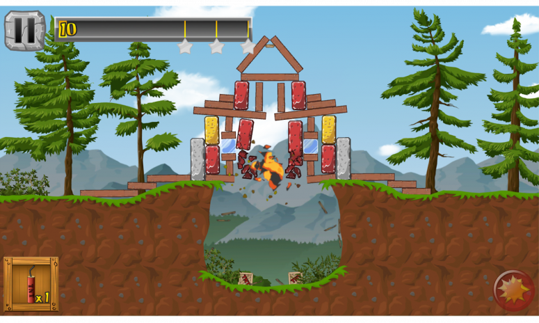

# Résumé de la conférence: Unity pour développer son premier jeu vidéo

## Cartouche d'identification

- Manifestation : CodeursEnSeine 2018
 - Lieu : Kindarena Rouen
 - Conférence : Unity 3D - Retour d'expérience sur une app d'1M download
 - Horaire de la conférence : 16h40
 - Durée de la conférence : 45min
 - Conférencier(s) :
   - Florian Duboc : https://fr.linkedin.com/in/florian-duboc-6100989b
 - Audience : Environ 100 participants
 - Auteur du billet : Matthis DUPONT
 - Mots-clés : Unity 3D - jeu mobile - optimisation
 - Illustration : 

## Support

- Lien vers le support (diapos) présenté en conférence : Indisponible
- Nombre de diapos du support : Non communiqué
- Plan du support : Non communiqué

## Résumé

Florian Duboc a développé le jeu mobile “Little Demolition” pendant son temps libre, tout en apprenant à utiliser l’éditeur Unity. Ce jeu a atteint 1 million de téléchargements. Aujourd’hui, il propose son retour d’expérience dans une conférence où il présente son jeu, les raisons qui l’ont poussé à choisir Unity, ainsi que des conseils d’optimisation pour Unity.

Le meilleur atout de Unity est sans aucun doute sa facilité d’utilisation. De nombreuses fonctionnalités sont inclues, et cela permet de réaliser très simplement de nombreuses choses, comme la physique du jeu, ou encore l’inclusion de publicités.

Unity possède aussi une grande communauté. C’est un moteur de jeu très populaire, d’autant plus pour les développeurs de jeux vidéos indépendants. De nombreux tutoriels sont disponibles, ainsi que des forums dédiés. Unity possède aussi un asset store, qui permet de faciliter la recherche et l’import de ressources gratuites ou payantes pour un jeu. 

Pour finir, il faut aussi mentionner qu’Unity permet de build les jeux sur plusieurs plateformes, et met à disposition des développeur une “Personal Edition”, qui permet aux développeurs de l’utiliser gratuitement sous certaines conditions, basées sur un plafonnement des revenus générés.

## Architecture et facteur qualité

En ce qui concerne le choix du moteur de jeu, cette conférence a permis de mettre en avant les facteurs qualité suivants :
- La facilité d’utilisation : ce qui est tout ou en partie inclus (exemple : gestion de la physique, de la lumière, du son, inclusion de publicité...)
- Les ressources disponibles : présence d’une communauté, aide disponible, ressources disponibles au téléchargement
- Le prix
- L’interopérabilité : builds possibles pour différents environnements
